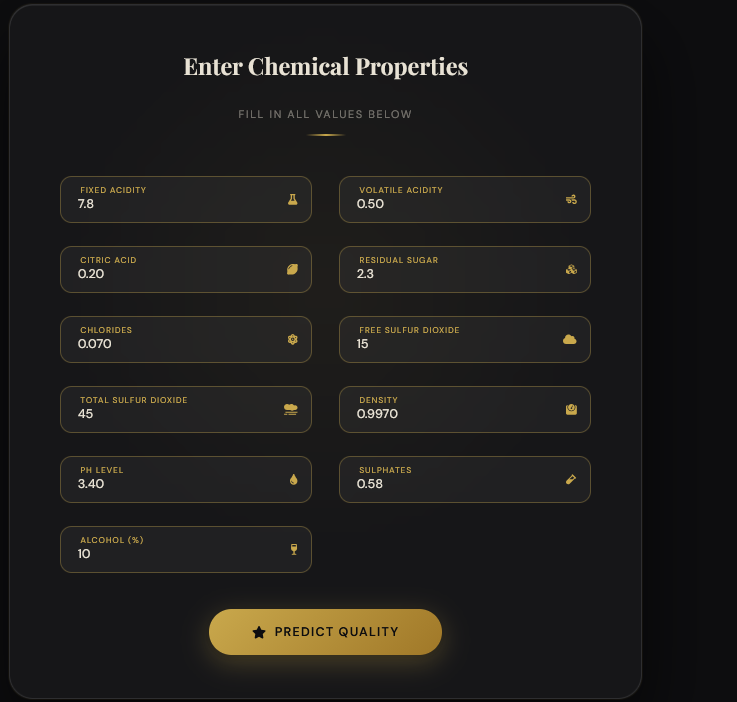
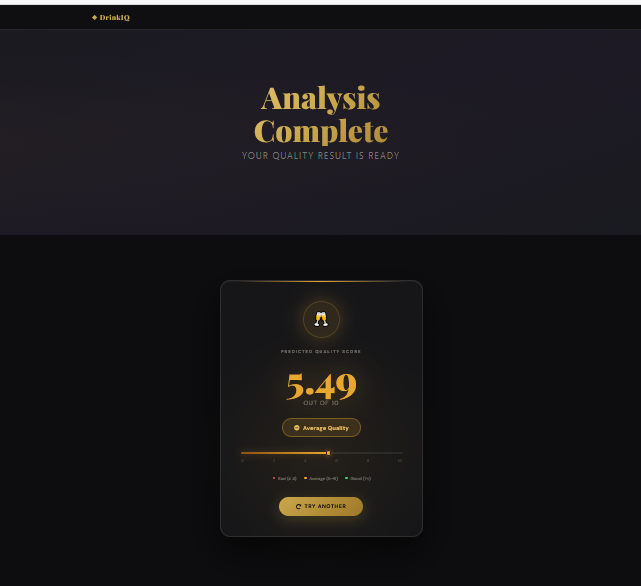

# Intelligent-Drink-Quality-Prediction-System-using-Machine-Learning-Pipeline

# 📌 Project Overview

The **Intelligent Drink Quality Prediction System** is an end-to-end Machine Learning project designed to predict drink quality based on physicochemical properties.

This project demonstrates a complete production-ready ML workflow including data ingestion, validation, transformation, model training, evaluation, deployment, and web application integration.

The system uses an **ElasticNet Regression Model** to predict the quality score of drinks using multiple chemical features.

## ✨ Features

* ✅ **End-to-End ML Pipeline** — From raw data ingestion to live predictions
* ✅ **Data Validation** — Schema-based integrity checks before training
* ✅ **Modular Codebase** — Clean separation of ingestion, validation, transformation, training, and evaluation
* ✅ **Flask Web UI** — User-friendly interface for real-time quality prediction
* ✅ **Dockerized** — Fully containerized for consistent environments
* ✅ **CI/CD Ready** — Automated build, test, and deploy via GitHub Actions
* ✅ **Cloud Deployed** — Hosted on AWS EC2 with images stored in ECR

# 📊 Dataset Features

The model is trained using the following input features:

| Feature Name         | Description                          |
| -------------------- | ------------------------------------ |
| Fixed Acidity        | Non-volatile acids present in drinks |
| Volatile Acidity     | Amount of acetic acid                |
| Citric Acid          | Freshness and flavor contributor     |
| Residual Sugar       | Sugar remaining after fermentation   |
| Chlorides            | Salt concentration                   |
| Free Sulfur Dioxide  | Free SO₂ content                    |
| Total Sulfur Dioxide | Total SO₂ content                   |
| Density              | Density of the liquid                |
| pH                   | Acidity/basicity level               |
| Sulphates            | Sulfate concentration                |
| Alcohol              | Alcohol percentage                   |

## 🏗️ Project Structure

```
Intelligent-Drink-Quality-Prediction-System/
│
├── config/
│   └── config.yaml              # File paths and source configurations
│
├── src/
│   ├── components/              # Modular pipeline components
│   ├── pipeline/                # Stage-wise pipeline scripts
│   └── config/                  # Configuration manager
│
├── params.yaml                  # Model hyperparameters (alpha, l1_ratio)
├── schema.yaml                  # Expected data types and schema
├── app.py                       # Flask web application entry point
├── main.py                      # Pipeline runner
├── requirements.txt             # Python dependencies
├── Dockerfile                   # Docker container definition
└── .github/
    └── workflows/               # GitHub Actions CI/CD workflow
```

## 🔄 ML Pipeline Stages

```
Stage 01 → Data Ingestion       (Download & unzip dataset)
    ↓
Stage 02 → Data Validation      (Check schema & data integrity)
    ↓
Stage 03 → Data Transformation  (Preprocess & prepare features)
    ↓
Stage 04 → Model Trainer        (Train ElasticNet regression model)
    ↓
Stage 05 → Model Evaluation     (Evaluate performance metrics)
```

## ⚙️ Workflow (Development Guide)

Follow this order when updating the project:

1. `config/config.yaml` — Update source paths and artifact locations
2. `schema.yaml` — Update expected data columns and types
3. `params.yaml` — Update model hyperparameters
4. **Entity** — Update data classes/entities
5. **Configuration Manager** (`src/config`) — Update config loading
6. **Components** — Update individual pipeline components
7. **Pipeline** — Update stage pipeline scripts
8. `main.py` — Update the pipeline runner
9. `app.py` — Update Flask routes if needed

### Installation & Run

**Step 1: Clone the Repository**

```bash
git clone https://github.com/your-username/Intelligent-Drink-Quality-Prediction-System-using-Machine-Learning-Pipeline.git
cd Intelligent-Drink-Quality-Prediction-System-using-Machine-Learning-Pipeline
```

**Step 2: Create a Virtual Environment**

```bash
conda create -n mlproj python=3.10 -y
```

**Step 3: Activate the Environment**

```bash
conda activate mlproj
```

**Step 4: Install Requirements**

```bash
pip install -r requirements.txt
```

**Step 5: Run the Application**

```bash
python app.py
```

The app will be available at: **`http://localhost:5000`**

## 🌐 Web Application Routes

| Route        | Method | Description                                          |
| ------------ | ------ | ---------------------------------------------------- |
| `/`        | GET    | Home page                                            |
| `/train`   | GET    | Trigger the full training pipeline                   |
| `/predict` | POST   | Submit drink features → get predicted quality score |

---

## 🐳 Docker Deployment

**Build the Docker image:**

```bash
docker build -t drink-quality-predictor .
```

**Run the container:**

```bash
docker run -p 5000:5000 drink-quality-predictor
```

---

## ☁️ CI/CD & Cloud Deployment

This project is configured for **automated deployment** using:

| Component          | Technology       |
| ------------------ | ---------------- |
| CI/CD Pipeline     | GitHub Actions   |
| Cloud Platform     | AWS EC2 (Ubuntu) |
| Container Registry | AWS ECR          |
| Containerization   | Docker           |

**Deployment Flow:**

```
Push to GitHub → GitHub Actions triggers →
Build Docker Image → Push to AWS ECR →
Pull & Deploy on AWS EC2
```

---

## 🚀 AWS CI/CD Deployment with GitHub Actions

### 1. Login to AWS Console

- Go to [https://aws.amazon.com/console/](https://aws.amazon.com/console/) and sign in

---

### 2. Create IAM User for Deployment

```
#with specific access

1. EC2 access : It is virtual machine

2. ECR: Elastic Container Registry to save your docker image in aws
```

```
#Description: About the deployment

1. Build docker image of the source code

2. Push your docker image to ECR

3. Launch Your EC2

4. Pull Your image from ECR in EC2

5. Launch your docker image in EC2
```

```
#Policy:

1. AmazonEC2ContainerRegistryFullAccess

2. AmazonEC2FullAccess
```

---

### 3. Create ECR Repo to Store/Save Docker Image

```
- Save the URI: 315865595366.dkr.ecr.us-east-1.amazonaws.com/drinkqualityrepo
```

---

### 4. Create EC2 Machine (Ubuntu)

---

### 5. Open EC2 and Install Docker in EC2 Machine

```bash
#optional

sudo apt-get update -y

sudo apt-get upgrade -y
```

```bash
#required

curl -fsSL https://get.docker.com -o get-docker.sh

sudo sh get-docker.sh

sudo usermod -aG docker ubuntu

newgrp docker
```

---

### 6. Configure EC2 as Self-Hosted Runner

```
setting > actions > runner > new self hosted runner > choose os > then run command one by one
```

---

### 7. Setup GitHub Secrets

```
AWS_ACCESS_KEY_ID
AWS_SECRET_ACCESS_KEY
AWS_DEFAULT_REGION
ECR_REPO
```

---

## 🛠️ Technologies Used

| Category          | Technology                |
| ----------------- | ------------------------- |
| Language          | Python 3.10               |
| Web Framework     | Flask                     |
| ML Library        | Scikit-learn (ElasticNet) |
| Data Processing   | Pandas, NumPy             |
| Containerization  | Docker                    |
| Cloud             | AWS EC2, AWS ECR          |
| CI/CD             | GitHub Actions            |
| Config Management | YAML                      |

# Author

Bijoy Dewanjee

**GitHub** : [https://github.com/BijoyDewanjee](https://github.com/BijoyDewanjee)

---


# My Project Pic






---

## 📄 License

This project is licensed under the MIT License. See the [LICENSE](LICENSE) file for details.
